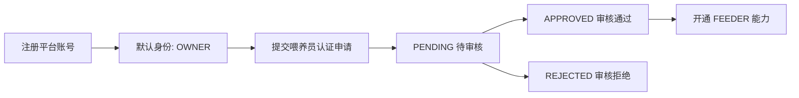
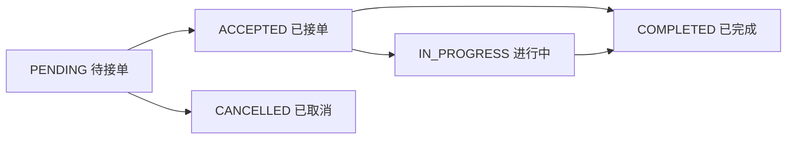
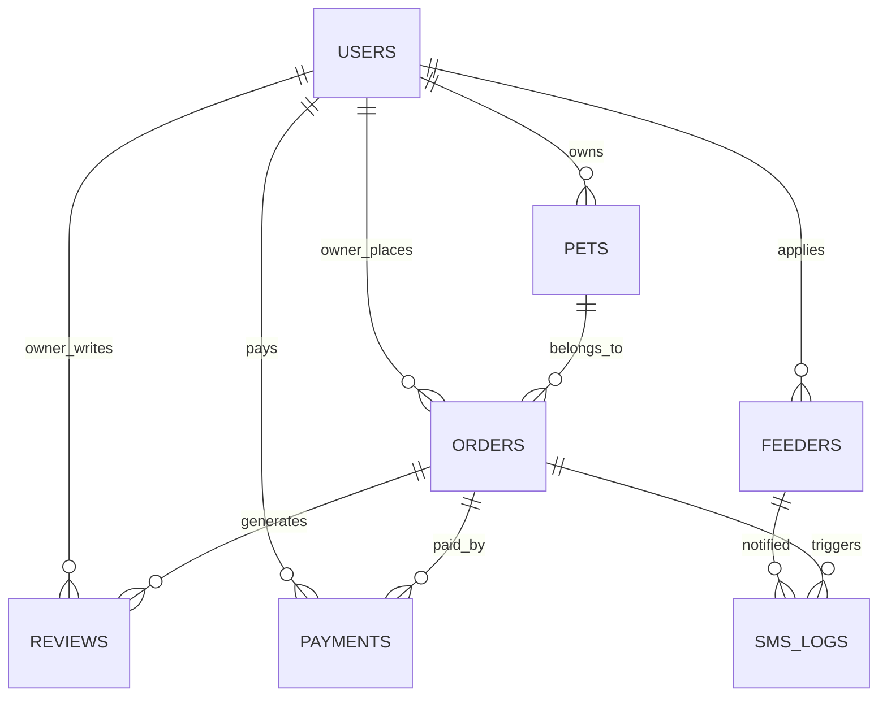

# 宠物喂养平台设计说明

## 1. 页面清单

### 1.1 小程序页面

| 页面路径 | 页面名称 | 角色 | 说明 |
| --- | --- | --- | --- |
| `pages/login/login` | 登录/注册 | OWNER/FEEDER | 平台统一账号注册与密码登录 |
| `pages/index/index` | 首页 | OWNER/FEEDER/ADMIN说明 | 角色化首页入口 |
| `pages/orders/list` | 订单列表 | OWNER/FEEDER | 主人查看我的订单，喂养员查看接单列表 |
| `pages/mine/index` | 我的 | OWNER/FEEDER/ADMIN说明 | 角色化个人中心 |
| `pages/pets/list` | 我的宠物 | OWNER | 宠物列表 |
| `pages/pets/add/add` | 添加/编辑宠物 | OWNER | 宠物资料维护 |
| `pages/feeders/list` | 喂养员列表 | OWNER/FEEDER/ADMIN浏览 | 查看喂养员展示 |
| `pages/feeders/detail/detail` | 喂养员详情 | OWNER/FEEDER/ADMIN浏览 | 查看喂养员详情和评价 |
| `pages/orders/create/create` | 预约喂养 | OWNER | 创建订单 |
| `pages/orders/detail/detail` | 订单详情 | OWNER/FEEDER | 查看并操作订单 |
| `pages/reviews/create/create` | 创建评价 | OWNER | 服务完成后评价 |
| `pages/feeder/apply/apply` | 申请成为喂养员 | OWNER | 喂养员认证申请 |

### 1.2 后台页面

| 路由 | 页面名称 | 说明 |
| --- | --- | --- |
| `/login` | 登录 | 后台管理员登录 |
| `/` | 仪表盘 | 平台整体统计 |
| `/users` | 客户管理 | 客户列表、状态、删除、统计展示 |
| `/admins` | 管理员管理 | 管理员新增、状态管理、删除 |
| `/pets` | 宠物管理 | 宠物后台总览 |
| `/feeders` | 喂养员管理 | 审核、删除、查看资料 |
| `/feeders/:id/reviews` | 喂养员评价 | 按喂养员查看评价 |
| `/orders` | 订单管理 | 订单筛选、取消、分配 |
| `/reviews` | 评价管理 | 平台评价管理 |
| `/payments` | 支付记录 | 支付记录查看 |

## 2. 接口清单

### 2.1 小程序接口

#### 认证
- `POST /api/miniapp/auth/login`
- `POST /api/miniapp/auth/register`
- `POST /api/miniapp/auth/password-login`

#### 宠物
- `GET /api/miniapp/pets`
- `POST /api/miniapp/pets`
- `PUT /api/miniapp/pets/{id}`
- `DELETE /api/miniapp/pets/{id}`

#### 喂养员
- `GET /api/miniapp/feeders`
- `POST /api/miniapp/feeders`
- `GET /api/miniapp/feeders/{id}/reviews`

#### 订单
- `GET /api/miniapp/orders`
- `GET /api/miniapp/orders/pending`
- `POST /api/miniapp/orders`
- `PUT /api/miniapp/orders/{id}/accept`
- `PUT /api/miniapp/orders/{id}/start`
- `PUT /api/miniapp/orders/{id}/complete`
- `PUT /api/miniapp/orders/{id}/cancel`

#### 评价
- `POST /api/miniapp/reviews`
- `GET /api/miniapp/reviews/feeder/{feederId}`

### 2.2 后台接口

#### 仪表盘
- `GET /api/dashboard/stats`

#### 用户管理
- `POST /api/user/register`
- `POST /api/user/login`
- `GET /api/user/list`
- `PUT /api/user/{id}/status`
- `DELETE /api/user/{id}`

#### 喂养员管理
- `GET /api/feeder`
- `GET /api/feeder/pending`
- `PUT /api/feeder/{id}/approve`
- `PUT /api/feeder/{id}/reject`
- `DELETE /api/feeder/{id}`

#### 订单管理
- `GET /api/order/all`
- `GET /api/order/my`
- `GET /api/order/pending`
- `POST /api/order`
- `PUT /api/order/{id}/cancel`
- `PUT /api/order/{id}/assign`

#### 宠物管理
- `GET /api/pet/all`
- `POST /api/pet`
- `PUT /api/pet/{id}`
- `DELETE /api/pet/{id}`

#### 评价管理
- `GET /api/review/all`
- `GET /api/review/feeder/{feederId}`
- `DELETE /api/review/{id}`

#### 支付管理
- `GET /api/payment/all`

## 3. 状态流转图

### 3.1 用户身份流转

### 3.2 订单状态流转

### 3.3 角色操作边界

- `OWNER`：创建订单、取消待接单订单、确认完成、评价
- `FEEDER`：接单、开始服务、查看自己负责的订单
- `ADMIN`：在后台进行审核、分配、删除、查看统计

## 4. 数据表关系说明

### 4.1 核心表

| 表名 | 实体 | 说明 |
| --- | --- | --- |
| `users` | `User` | 平台统一用户表 |
| `pets` | `Pet` | 宠物资料表 |
| `feeders` | `Feeder` | 喂养员认证与展示资料 |
| `orders` | `Order` | 喂养服务订单 |
| `reviews` | `Review` | 服务评价 |
| `payments` | `Payment` | 支付记录 |
| `sms_logs` | `SmsLog` | 短信通知日志 |

### 4.2 表关系

### 4.3 关键外键语义

- `pets.user_id -> users.id`
- `feeders.user_id -> users.id`
- `orders.owner_id -> users.id`
- `orders.feeder_id -> users.id`
- `orders.pet_id -> pets.id`
- `reviews.order_id -> orders.id`
- `reviews.owner_id -> users.id`
- `reviews.feeder_id -> feeders.id`
- `payments.order_id -> orders.id`
- `payments.user_id -> users.id`
- `sms_logs.order_id -> orders.id`
- `sms_logs.feeder_id -> feeders.id`

### 4.4 说明

- 平台采用统一账号模型，`users` 是所有身份的基础
- 喂养员不是独立账号体系，而是 `users` 上衍生出的服务身份
- 订单中的 `feeder_id` 当前语义为喂养员对应的用户 ID，用于和小程序接单逻辑保持一致
